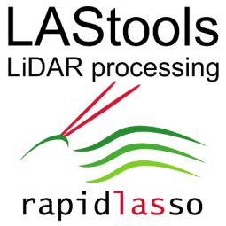

# LAStools

**Award-winning software for efficient LiDAR processing (with LASzip)**

## Overview

Tools for processing LiDAR data files.
The data files are in ASPRS LAS format (version 1.0-1.4) or lossless compressed, (but otherwise, identical twin), LAZ format.
The table below provides information about the tools and converters provided.

LAStools consist of different parts:
* LASlib, the low-level processing API.
* LASzip, the compression/decompression API.
Both parts are free and open source.
* LAStools Software Suite.
Additional tools based on LASlib and LASzip for processing LiDAR data.
Some of the tools are free to use, others are licensed.

All code is written in ultra-lightweight, very efficient, and super-fast C++.

LAStools are a collection of highly efficient, multi-core batched, scriptable tools to process LAS, compressed LAZ, Terrasolid BIN, ESRI Shapefiles (SHP), ASCII, and others.

The open-source part is located in
.\LASlib and
.\LASzip
The documentation is located in
.\bin

### Open source tools:

* `laszip` powerful, lossless LiDAR compressor that turns large LAS files into much smaller LAZ files
* `las2las` extracts last returns, clips, subsamples, translates, etc. ...
* `las2txt` turns LAS into human-readable and easy-to-parse ASCII
* `txt2las` converts LIDAR data from ASCII text to binary LAS format
* `lasindex` creates a spatial index LAX file for fast spatial queries
* `lasmerge` merges several LAS or LAZ files into a single LAS or LAZ file
* `lasinfo` prints out a quick overview of the contents of a LAS file
* `lascopcindex` creates a COPC *.laz file for a given set of *.las or *.laz files
* `lasdiff` compares LIDAR data and reports whether they are identical or different
* `lasprecision` analyses the actual precision of the LIDAR points

### Free tools:
* `lasvalidate` determine if LAS files are conform to the ASPRS LAS specifications
* `lasview` visualizes a LAS file with a simple OpenGL viewer
* `e572las` extracts the points from the E57 format and stores them as LAS/LAZ files
* `demzip` compresses and uncompresses raster data from ASC, BIL, TIF, IMG format to the compressed RasterLAZ format

### Closed source tools:

* `las2dem` rasters pointclouds (via a TIN) into elevation/slope/intensity/RGB DEMs
* `las2iso` extracts, optionally simplified, elevation contours
* `las2shp` turns binary LAS into ESRI's Shapefile format
* `las2tin` triangulates the points of a LAS file into a TIN
* `las3dpoly` modifies points within a certain distance of 3D polylines
* `lasboundary` extracts a boundary polygon that encloses the points
* `lascanopy` computes many raster and plot metrics for forestry applications
* `lasclassify` finds buildings and the vegetation above the ground
* `lasclip` clips points against building footprints / swath boundaries
* `lascolor` colors the LAS points based on ortho imagery in TIF format
* `lascontrol` quality checks elevations for a list of control points
* `lascopy` copies ttributes using the GPS-time stamp and the return number
* `lasdatum` transforms rom one horizontal datum to another
* `lasdistance` classifies,flags, or removes points based on distance from polygonal segments
* `lasduplicate` removes duplicate points (with identical x and y, z optional)
* `lasgrid` grids onto min/max/avg/std elevation, intensity, or counter rasters
* `lasground` extracts the bare earth by classifying all ground points
* `lasground_new` an improved version of lasground for complex terrains
* `lasheight` computes for each point its height above the ground
* `lasintensity` corrects the intensity attenuation due to atmospheric absorption
* `lasnoise` flags r removes noise points in LAS/LAZ/BIN/ASCII files
* `lasoptimize` optimizes ata for better compression and spatial coherency
* `lasoverage` finds he "overage" of an airborne collect that get covered by multiple flightline
* `lasoverlap` checks overlap & vertical/horizontal alignment of flight lines
* `lasplanes` finds planar patches in terrestrial, mobile, (airborne?) scans
* `lasprecision` reads IDAR data in the LAS format and computes statistics about precision "advertised" in the header
* `lasprobe` probes he elevation of a LIDAR for a given x and y location
* `laspublish` do D visualization of LiDAR data in a web browser using the WebGL Potree
* `lasreturn` reports eometric return statistics and repairs 'number of returns' field based on GPS times
* `lassort` sorts points by gps_time, point_source, or into spatial proximity
* `lassplit` splits points of LAS file(s) into flightlines or other criteria
* `lasthin` thins lowest / highest / random LAS points via a grid
* `lastile` tiles huge amounts of LAS points into square tiles
* `lastool` is an old GUI for multiple LAStools (now each tool has its own GUI)
* `lastrack` classifies LiDAR point based on distance from a trajectory
* `lasvdatum` transforms iDAR from ellipsoidal to orthometric elevations using a grid
* `lasvoxel` computes voxelization of points
* `shp2las` turns an ESRI's Shapefile into binary LAS

## BLAST extension

* `blast2dem` rasters like las2dem, but with streaming TINs for billions of points.
* `blast2iso` contours like las2iso, but with streaming TINs for billions of points.

# Installation

Binary downloads for Windows and Linux are available at 
  https://rapidlasso.de/downloads
The LAStools download contains all binaries of the open source and licensed tools.
It also contains the LASzip/LASlib libraries and all BLAST binaries.
All licensed tools can be tested for free up to the point limit (~3-5 million points).

## Windows

All binaries are included in the download file.
There is a full installer download and a binary-only download.
For the binary download:
1. create directory "c:\lastools"
2. unzip LAStools.zip to this directory
3. run the LAStools executables

## Linux

Detailed information at https://rapidlasso.de/lastools-linux/

1. create an installation target and extract the package

    cd ~
    mkdir lastools
    cd lastools
    wget https://downloads.rapidlasso.de/LAStools.tar.gz
    tar xvzf LAStools.tar.gz
    rm LAStools.tar.gz
    
2. expand your library path to include your installation directory

    export LD_LIBRARY_PATH=.:$LD_LIBRARY_PATH

3. install dependencies

    sudo apt-get install libjpeg62 libpng-dev libtiff-dev libjpeg-dev libz-dev libproj-dev liblzma-dev libjbig-dev libzstd-dev libgeotiff-dev libwebp-dev liblzma-dev libsqlite3-dev

4. run the LAStools executables

    ./laszip64

# Examples

Numerous examples can be found in the included readme files in the bin directory.
Some sample DOS batch scripts can be found in the `.\example_batch_scripts` directory.

# Open source tools

All open source tools can be compiled from source code.
A ready-to-use MSVS solution file (LAStools.sln) is available for Windows.
This solution builds all open source tools and dlls in 64 bit.
There is a cmake file for Linux and MacOS.
Just go to the root directory and run
    cmake -DCMAKE_BUILD_TYPE=Release CMakeLists.txt  
    cmake --build .  
The QGIS toolbox can be installed within QGIS, see (https://rapidlasso.de/lastools-as-qgis-plugin/).
The binary download contains the plugin for ArcGIS in `.\ArcGIS_toolbox`.

# Links

Binary download at
https://rapidlasso.de/downloads/

* official website:  https://rapidlasso.de
* user group:     http://groups.google.com/group/lastools

# License

Please read the `LICENSE.txt` file for legal use and licensing information.
Your feedback is highly appreciated. Feel free to let us know what you use LAStools for and what features and improvements you might need.

(c) 2007-2024 info@rapidlasso.de - https://rapidlasso.de
